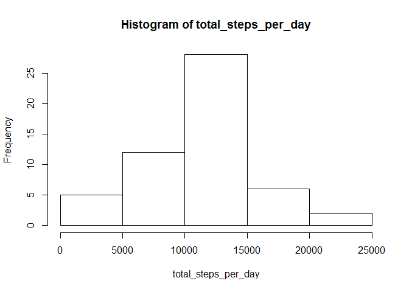
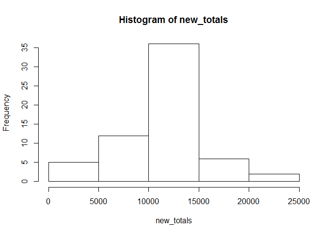
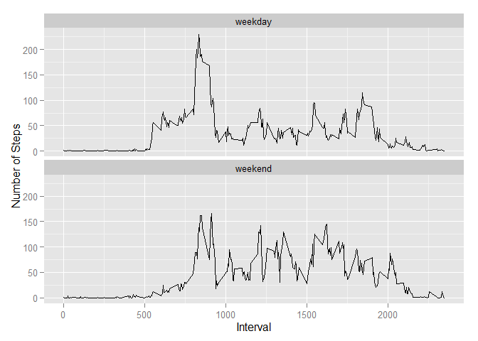

# Reproducible Research: Peer Assessment 1
## Introduction
It is now possible to collect a large amount of data about personal movement using activity monitoring devices such as a Fitbit, Nike Fuelband, or Jawbone Up. These type of devices are part of the "quantified self" movement -- a group of enthusiasts who take measurements about themselves regularly to improve their health, to find patterns in their behavior, or because they are tech geeks. But these data remain under-utilized both because the raw data are hard to obtain and there is a lack of statistical methods and software for processing and interpreting the data.

This assignment makes use of data from a personal activity monitoring device. This device collects data at 5 minute intervals through out the day. The data consists of two months of data from an anonymous individual collected during the months of October and November, 2012 and include the number of steps taken in 5 minute intervals each day.

## Data 
The data for this assignment has the following variables:

 - **steps**: Number of steps taking in a 5-minute interval (missing values are coded as NA)
 - **date**: The date on which the measurement was taken in YYYY-MM-DD format
 - **interval**: Identifier for the 5-minute interval in which measurement was taken

The dataset is stored in a comma-separated-value (CSV) file and there are a total of 17,568 observations in this dataset.

## Loading and preprocessing the data

```r
data <- read.csv(unz("activity.zip", "activity.csv"))
```

## What is mean total number of steps taken per day?
For this part of the assignment, we are allowed to ignore the missing values in the dataset.

1. Make a histogram of the total number of steps taken each day


```r
total_steps_per_day <- tapply(data$steps, data$date, sum)
hist(total_steps_per_day)
```

 

2. Calculate and report the mean and median total number of steps taken per day


```r
mean_steps <- as.integer(mean(total_steps_per_day, na.rm=TRUE))
median_steps <- median(total_steps_per_day, na.rm=TRUE)
```
Mean total number of steps taken per day is 10766.
Median total number of steps taken per day is 10765.

## What is the average daily activity pattern?
1. Make a time series plot (i.e. type = "l") of the 5-minute interval (x-axis) and the average number of steps taken, averaged across all days (y-axis)


```r
averages <- aggregate(steps ~ interval, data, mean, na.rm=TRUE)
plot(averages, type='l')
```

 

2. Which 5-minute interval, on average across all the days in the dataset, contains the maximum number of steps?


```r
max_number <- max(averages$steps)
max_inteval <- averages$interval[averages$steps == max_number]
```
The 5-munite interval containing the maximum number of steps is 835.

## Imputing missing values
Note that there are a number of days/intervals where there are missing values (coded as NA). The presence of missing days may introduce bias into some calculations or summaries of the data.

1. Calculate and report the total number of missing values in the dataset (i.e. the total number of rows with NAs)


```r
missing_value_count <- sum(is.na(data$steps))
```
The total number of missing values in the dataset is 2304.

2. Use the mean for that 5-minute interval across all days to fill all of the missing values in the dataset. Since most people will follow a daily routine, it makes more sense to infer the missing value with the mean of 5-minute interval. The structure of average steps of 5-minute interval that we will use to fill the corresponding missing steps:


```r
str(averages)
```

```
## 'data.frame':	288 obs. of  2 variables:
##  $ interval: int  0 5 10 15 20 25 30 35 40 45 ...
##  $ steps   : num  1.717 0.3396 0.1321 0.1509 0.0755 ...
```

3. Create a new dataset that is equal to the original dataset but with the missing data filled in.


```r
new_steps <- tapply(data$steps, data$date, function(x) { x[is.na(x)] <- averages$steps[which(is.na(x))]; x } )
new_data <- data
new_data[,1] <- as.vector(unlist(new_steps))
```

4. Make a histogram of the total number of steps taken each day and Calculate and report the mean and median total number of steps taken per day. Do these values differ from the estimates from the first part of the assignment? What is the impact of imputing missing data on the estimates of the total daily number of steps?


```r
new_totals <- tapply(new_data$steps, new_data$date, sum)
hist(new_totals)
```

 

```r
new_mean <- as.integer(mean(new_totals))
new_median <- as.integer(median(new_totals))
```
The new mean is 10766, and the new median is 10766. Mean is the same from the estimate from the first part of the assignment, and median differs only by one. However, imputing missing data has made the estimates of the total daily number of steps more centered on the mean.


## Are there differences in activity patterns between weekdays and weekends?

For this part the weekdays() function may be of some help here. Use the dataset with the filled-in missing values for this part.

1. Create a new factor variable in the dataset with two levels -- "weekday" and "weekend" indicating whether a given date is a weekday or weekend day.


```r
new_data$week <- factor(weekdays(as.Date(new_data$date)) %in% c('Saturday', 'Sunday'), level=c(FALSE, TRUE), label=c('weekday', 'weekend'))
```

2. Make a panel plot containing a time series plot (i.e. type = "l") of the 5-minute interval (x-axis) and the average number of steps taken, averaged across all weekday days or weekend days (y-axis).


```r
nn <- aggregate(steps ~ week + interval, new_data, mean)

library(ggplot2)
g <- ggplot(nn , aes(interval, steps))
g <- g + geom_line() + facet_wrap(~ week, ncol=1)
g <- g + xlab("Interval") + ylab("Number of Steps")
print(g)
```

 
There are differences in activity patterns between weekday and weekend. During weekdays, the activity peaks around 800th interval, while the activity is more even duing weekends.
